<div align="center">
  

  <br>

  [](https://github.com/jivoi/awesome-osint)
  [](https://www.python.org/)
  [](LICENSE)
  [](tests/)
  <br>
  [](../../stargazers)
  [](../../network/members)
  [](../../commits)
  [](../../issues)

  <br>

  <p><b>Investigate IPs, domains, hashes, and CVEs across 6 free threat intel APIs — without switching between browser tabs.</b></p>

  <p>
    <a href="#-quick-start"><b>Quick Start</b></a> ·
    <a href="#-usage"><b>Usage</b></a> ·
    <a href="#️-architecture"><b>Architecture</b></a> ·
    <a href="#-api-keys"><b>API Keys</b></a> ·
    <a href="#-screenshots"><b>Screenshots</b></a> ·
    <a href="#-contributing"><b>Contributing</b></a>
  </p>
</div>

<br>

> 🚀 Proudly featured in the official **[Awesome OSINT](https://github.com/jivoi/awesome-osint)** repository.

---

## 📖 Overview

**ThreatLens** is a single command-line tool that unifies threat intelligence lookups across the most trusted free OSINT sources. Instead of pasting an IP into five different websites, ThreatLens queries them all in parallel, normalizes the results, and gives you a clear verdict — in the terminal, or in a polished, color-coded Excel/JSON/CSV report.

Built for SOC analysts, incident responders, threat hunters, and anyone who wants fast, reliable IOC enrichment without leaving the shell.

<table>
<tr>
<td width="50%" valign="top">

**Why ThreatLens**
- One command instead of five browser tabs
- Auto-extracts IOCs straight out of raw logs
- A single failing/rate-limited API never blocks the rest
- Works entirely on free API tiers

</td>
<td width="50%" valign="top">

**Not for**
- Real-time/streaming detection pipelines
- Paid/enterprise-only intel feeds
- Replacing a full SIEM or SOAR platform

</td>
</tr>
</table>

---

## ✨ Features

| Feature | Details |
|---|---|
| 🎯 **IOC Types** | IP, Domain, URL, File Hash (MD5 / SHA1 / SHA256), CVE |
| 🔌 **Integrated APIs** | AbuseIPDB, VirusTotal, AlienVault OTX, Shodan, URLScan.io, NVD |
| 📄 **Log Parsing** | Automatically extracts every IOC type from any log or text file |
| 📊 **Reports** | Excel (color-coded), JSON, CSV |
| 💻 **CLI Experience** | Rich progress bars, colored tables, and a clean verdict summary |
| 🧩 **Architecture** | Modular enrichers, typed models, strict separation of concerns |
| ✅ **Tested** | Unit tests with `pytest` |
| ⚡ **Resilient** | One failing API never blocks the others — errors are isolated and logged |

---

## 🚀 Quick Start

```bash
# 1. Clone & install
git clone https://github.com/AbdaullahAG/threatlens.git
cd threatlens
pip install -r requirements.txt

# 2. Configure your API keys
cp config/keys.env.example config/keys.env
# → edit config/keys.env and fill in your keys

# 3. Run your first scan
python main.py -i 45.33.32.156
```

> 💡 **NVD (CVE lookups) works out of the box with no API key.** Every other API offers a free tier that takes under 2 minutes to sign up for — see [API Keys](#-api-keys) below.

---

## 🧰 Usage

<table>
<tr><td>

```bash
# Investigate a single IP
python main.py -i 45.33.32.156
```

</td><td>Basic single-IOC lookup</td></tr>
<tr><td>

```bash
# Investigate multiple IOC types at once
python main.py -i 45.33.32.156 -d malware.example.com \
  -s d41d8cd98f00b204e9800998ecf8427e -c CVE-2021-44228
```

</td><td>Mix and match IOC types in one run</td></tr>
<tr><td>

```bash
# Parse a log file — all IOCs auto-extracted
python main.py --file /var/log/apache2/access.log
```

</td><td>Bulk investigate straight from raw logs</td></tr>
<tr><td>

```bash
# Output JSON instead of Excel
python main.py -i 8.8.8.8 --format json
```

</td><td>Machine-readable output for pipelines</td></tr>
<tr><td>

```bash
# Use only specific APIs
python main.py -i 8.8.8.8 --apis abuseipdb virustotal
```

</td><td>Restrict enrichment to selected sources</td></tr>
<tr><td>

```bash
# Generate every report format at once
python main.py --file access.log --format all
```

</td><td>Excel + JSON + CSV in a single run</td></tr>
<tr><td>

```bash
# Verbose / debug mode
python main.py -i 8.8.8.8 -v
```

</td><td>Full request/response logging for troubleshooting</td></tr>
</table>

<details>
<summary><b>See all CLI flags</b></summary>
<br>

| Flag | Description |
|---|---|
| `-i, --ip` | IP address(es) to investigate |
| `-d, --domain` | Domain(s) to investigate |
| `-s, --hash` | File hash(es) — MD5 / SHA1 / SHA256 |
| `-c, --cve` | CVE ID(s), e.g. `CVE-2021-44228` |
| `--file` | Path to a log/text file to auto-extract IOCs from |
| `--apis` | Restrict enrichment to a specific set of APIs |
| `--format` | Output format: `excel` (default) \| `json` \| `csv` \| `all` |
| `--delay` | Delay between API calls, for rate-limit tuning |
| `-v, --verbose` | Enable debug logging |

</details>

---

## 🏗️ Architecture

```
threat_intel_tool/
├── main.py                     # CLI entry point
├── requirements.txt
├── config/
│   └── keys.env                # API keys (copy and fill in)
├── output/                     # Generated reports land here
├── src/
│   ├── engine.py                # Main orchestrator
│   ├── models.py                # IOC & EnrichmentResult dataclasses
│   ├── parsers/
│   │   └── ioc_parser.py        # Regex-based IOC extractor
│   ├── enrichers/
│   │   ├── base.py              # Abstract base class
│   │   ├── registry.py          # Enricher dispatcher
│   │   ├── abuseipdb.py         # AbuseIPDB      (IP)
│   │   ├── virustotal.py        # VirusTotal     (IP / Domain / URL / Hash)
│   │   ├── otx.py               # AlienVault OTX (IP / Domain / URL / Hash)
│   │   ├── shodan.py            # Shodan         (IP)
│   │   ├── urlscan.py           # URLScan.io     (URL / Domain)
│   │   └── nvd.py               # NVD / NIST     (CVE — no key required)
│   ├── reporters/
│   │   ├── excel_reporter.py    # Color-coded Excel reports
│   │   ├── other_reporters.py   # JSON & CSV output
│   │   └── terminal_display.py  # Rich terminal tables
│   └── utils/
│       ├── config.py            # API key loader
│       ├── logger.py            # Rich logging
│       └── banner.py            # ASCII banner
└── tests/
    └── test_core.py             # Unit tests
```

**Design principles**

- **Pluggable enrichers** — adding a new intel source only requires a new file in `src/enrichers/` that subclasses `BaseEnricher`. No changes needed elsewhere.
- **Typed IOCs** — IOC types are enums, not raw strings, catching mistakes at development time instead of runtime.
- **CI/CD-friendly config** — keys are read from `config/keys.env` with a fallback to system environment variables.
- **Per-enricher rate limiting** — configurable delay (`--delay`) keeps you within each API's free-tier limits.
- **Fault isolation** — every enricher error is caught, logged, and stored in `result.errors`; a single failing API never brings down the whole scan.

---

## 🔑 API Keys

| Provider | Sign Up | Free Tier |
|---|---|---|
| [AbuseIPDB](https://www.abuseipdb.com/register) | Free | 1,000 checks/day |
| [VirusTotal](https://www.virustotal.com/gui/join-us) | Free | 4 req/min · 500 req/day |
| [AlienVault OTX](https://otx.alienvault.com) | Free | Unlimited (public feed) |
| [Shodan](https://account.shodan.io/register) | Free | Limited lookups |
| [URLScan.io](https://urlscan.io/user/signup) | Free | 5,000 req/day (search is free) |
| [NVD / NIST](https://nvd.nist.gov/developers/request-an-api-key) | Optional | No key required |

---

## 🧪 Testing

```bash
pytest tests/ -v

# With coverage
pytest tests/ -v --cov=src --cov-report=term-missing
```

---

## 📊 Sample Output

**Terminal:**

```
╭──────────────────────────── IOC Collection ─────────────────────────────╮
│ Found 4 IOCs to investigate                                              │
│   CVE: 1  Domain: 1  Hash: 1  IP: 1                                     │
╰──────────────────────────────────────────────────────────────────────────╯
✓ Active APIs: abuseipdb, virustotal, otx, shodan, urlscan, nvd

🌐 IP Address Results
┌─────────────────┬──────────────┬──────────┬─────────┬────────────────────┐
│ IP Address      │ Verdict      │ Abuse %  │ Country │ ISP / Org          │
├─────────────────┼──────────────┼──────────┼─────────┼────────────────────┤
│ 45.33.32.156    │ Suspicious   │ 42       │ US      │ Linode             │
└─────────────────┴──────────────┴──────────┴─────────┴────────────────────┘

⚠️  CVE Results
┌──────────────────┬──────────┬──────┬──────────────┐
│ CVE ID           │ Severity │ CVSS │ Published    │
├──────────────────┼──────────┼──────┼──────────────┤
│ CVE-2021-44228   │ Critical │ 10.0 │ 2021-12-10   │
└──────────────────┴──────────┴──────┴──────────────┘
```

**Excel Report:** Multi-sheet workbook with color-coded verdicts (🔴 malicious · 🟡 suspicious · 🟢 clean), saved to `output/ThreatLens_Report_<timestamp>.xlsx`

---

## 🖼️ Screenshots

<p align="center">
  
  
  
  
  
  
</p>

---

## 🗺️ Roadmap

- [ ] Async/parallel enrichment for faster multi-IOC scans
- [ ] Optional Docker image
- [ ] STIX/TAXII export format
- [ ] Web dashboard (read-only) for report browsing
- [ ] Additional enrichers (GreyNoise, IPQualityScore)

Have an idea? [Open an issue](../../issues) — contributions and suggestions are welcome.

---

## 🤝 Contributing

Contributions are welcome and appreciated!

1. Fork the repository
2. Create a feature branch: `git checkout -b feature/my-feature`
3. Add tests for any new behavior
4. Make sure `pytest tests/ -v` passes
5. Open a pull request with a clear description of the change

New enrichers, bug fixes, documentation improvements, and test coverage are all great first contributions — see [Architecture](#️-architecture) for how enrichers are structured.

---

## 📄 License

This project is licensed under the **[PolyForm Noncommercial License 1.0.0](LICENSE)**.

You're free to use, study, modify, and share this code for personal, educational, or research purposes. **Commercial use is not permitted** without prior written permission from the author (`Abd.moh9999@yahoo.com`).

---

## ⚠️ Legal Disclaimer

This tool is intended for **educational and authorized security testing purposes only**. The user is solely responsible for complying with the terms of service of the integrated APIs and all applicable laws. The author assumes no liability and is not responsible for any misuse, illegal activity, or damage caused by this program.

---

<div align="center">

If ThreatLens saved you time, consider giving it a ⭐ — it helps others discover the project.

</div>
