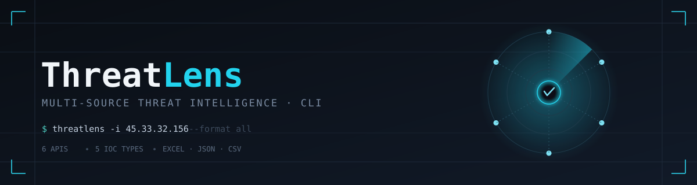

<div align="center">
  

  <br> 

[](https://github.com/jivoi/awesome-osint)
[](https://www.python.org/)
[](LICENSE)
[](tests/)
[](.github/workflows/security.yml)
[](#-contributing)
[](#)

  <br>

  <p><b>Investigate IPs, domains, hashes, and CVEs across 6 free threat intel APIs — without switching between browser tabs.</b></p>

  <p>
    <a href="#-quick-start"><b>Quick Start</b></a> ·
    <a href="#-usage"><b>Usage</b></a> ·
    <a href="#️-architecture"><b>Architecture</b></a> ·
    <a href="#-api-keys"><b>API Keys</b></a> ·
    <a href="#-screenshots"><b>Screenshots</b></a> ·
    <a href="#-contributing"><b>Contributing</b></a>
  </p>
</div>

<br>

> 🚀 Proudly featured in the official **[Awesome OSINT](https://github.com/jivoi/awesome-osint)** repository.

---

## 📖 Overview

**ThreatLens** is a single command-line tool that unifies threat intelligence lookups across the most trusted free OSINT sources. Instead of pasting an IP into five different websites, ThreatLens queries them all in parallel, normalizes the results, and gives you a clear verdict — in the terminal, or in a polished, color-coded Excel/JSON/CSV report.

Built for SOC analysts, incident responders, threat hunters, and anyone who wants fast, reliable IOC enrichment without leaving the shell.

<table>
<tr>
<td width="50%" valign="top">

**Why ThreatLens**
- One command instead of five browser tabs
- Auto-extracts IOCs straight out of raw logs
- A single failing/rate-limited API never blocks the rest
- Works entirely on free API tiers
- Local SQLite cache — repeated lookups are instant
- Request budget cap prevents runaway API spend

</td>
<td width="50%" valign="top">

**Not for**
- Real-time/streaming detection pipelines
- Paid/enterprise-only intel feeds
- Replacing a full SIEM or SOAR platform

</td>
</tr>
</table>

---

## ✨ Features

| Feature | Details |
|---|---|
| 🎯 **IOC Types** | IP, Domain, URL, File Hash (MD5 / SHA1 / SHA256), CVE |
| 🔌 **Integrated APIs** | AbuseIPDB, VirusTotal, AlienVault OTX, Shodan, URLScan.io, NVD, **CISA KEV**, **EPSS** |
| 📄 **Log Parsing** | Auto-extract IOCs from plain text/log files, plus native support for **Zeek**, **Suricata `eve.json`**, **Sysmon (JSON)**, and generic **JSONL** |
| 🧭 **CVE Decision Cards** | Deterministic, explainable **Patch / Isolate / Monitor / Not affected** recommendation per CVE, driven by CISA KEV, EPSS, CVSS, and correlated asset exposure |
| 🗂️ **Asset Inventory** | Import a CSV of hosts/IPs with criticality and internet-facing status; correlated against CVE results |
| 📤 **SIEM Export** | Opt-in export to **Splunk HEC**, **Elastic `_bulk`**, and **Microsoft Sentinel** (modern Logs Ingestion API) |
| 🧾 **Evidence Packs** | ZIP export of an investigation with a SHA-256 manifest for basic chain-of-custody |
| 📊 **Reports** | Excel (color-coded), JSON, CSV |
| 💾 **Local Cache** | SQLite cache with configurable TTL — skip re-querying known IOCs, plus a cached CISA KEV feed (24h TTL) |
| 🛡️ **Security** | Redirect blocking, host allow-listing, API-key redaction in logs, spreadsheet-formula neutralisation, CSV/log DoS limits |
| 🔒 **Lockfile** | `requirements.lock` with SHA-256 hashes for reproducible installs |
| 💻 **CLI Experience** | Rich progress bars, colored tables, and a clean verdict summary |
| 🧩 **Architecture** | Modular enrichers/parsers/exporters, typed models, strict separation of concerns |
| ✅ **Tested** | 155 unit & integration tests with `pytest`; CI via GitHub Actions |
| ⚡ **Resilient** | One failing API or SIEM destination never blocks the others — errors are isolated and logged |

---

## 🚀 Quick Start

```bash
# 1. Clone & install
git clone https://github.com/AbdaullahAG/threatlens.git
cd threatlens
pip install -r requirements.txt

# 2. Configure your API keys
cp config/keys.env.example config/keys.env
# → edit config/keys.env and fill in your keys

# 3. Run your first scan
python main.py -i 45.33.32.156
```

> 💡 **NVD (CVE lookups) works out of the box with no API key.** Every other API offers a free tier that takes under 2 minutes to sign up for — see [API Keys](#-api-keys) below.

### Reproducible install (with locked dependencies)

```bash
pip install --require-hashes -r requirements.lock
```

---

## 🧰 Usage

<table>
<tr><td>

```bash
# Investigate a single IP
python main.py -i 45.33.32.156
```

</td><td>Basic single-IOC lookup</td></tr>
<tr><td>

```bash
# Investigate multiple IOC types at once
python main.py -i 45.33.32.156 -d malware.example.com \
  -s d41d8cd98f00b204e9800998ecf8427e -c CVE-2021-44228
```

</td><td>Mix and match IOC types in one run</td></tr>
<tr><td>

```bash
# Parse a log file — all IOCs auto-extracted
python main.py --file /var/log/apache2/access.log
```

</td><td>Bulk investigate straight from raw logs</td></tr>
<tr><td>

```bash
# Output JSON instead of Excel
python main.py -i 8.8.8.8 --format json
```

</td><td>Machine-readable output for pipelines</td></tr>
<tr><td>

```bash
# Use only specific APIs
python main.py -i 8.8.8.8 --apis abuseipdb virustotal
```

</td><td>Restrict enrichment to selected sources</td></tr>
<tr><td>

```bash
# Generate every report format at once
python main.py --file access.log --format all
```

</td><td>Excel + JSON + CSV in a single run</td></tr>
<tr><td>

```bash
# Lookup a CVE — no API key needed
python main.py -c CVE-2021-44228 --apis nvd --format json
```

</td><td>CVE enrichment via NIST NVD (free, no key)</td></tr>
<tr><td>

```bash
# Verbose / debug mode
python main.py -i 8.8.8.8 -v
```

</td><td>Full request/response logging for troubleshooting</td></tr>
<tr><td>

```bash
# Check a CVE against CISA KEV + EPSS, with an asset-aware decision
python main.py -c CVE-2021-44228 --apis nvd cisa_kev epss \
  --import-assets assets.csv --decision-cards
```

</td><td>Patch / Isolate / Monitor / Not-affected recommendation</td></tr>
<tr><td>

```bash
# Parse a Suricata eve.json and export to Splunk
python main.py --file eve.json --log-format suricata \
  --export splunk
```

</td><td>SOC log ingestion → SIEM export</td></tr>
<tr><td>

```bash
# Build a hash-manifested evidence pack for the investigation
python main.py -i 45.33.32.156 --evidence-pack
```

</td><td>ZIP with a SHA-256 manifest for chain-of-custody</td></tr>
</table>

<details>
<summary><b>See all CLI flags</b></summary>
<br>

| Flag | Description |
|---|---|
| `-i, --ip` | IP address(es) to investigate |
| `-d, --domain` | Domain(s) to investigate |
| `-s, --hash` | File hash(es) — MD5 / SHA1 / SHA256 |
| `-c, --cve` | CVE ID(s), e.g. `CVE-2021-44228` |
| `--file` | Path to a log/text file to auto-extract IOCs from |
| `--log-format` | Format of `--file`: `auto` (default) \| `text` \| `zeek` \| `suricata` \| `sysmon` \| `jsonl` |
| `--apis` | Restrict enrichment to a specific set of APIs (now includes `cisa_kev`, `epss`) |
| `--format` | Output format: `excel` (default) \| `json` \| `csv` \| `all` |
| `--output` | Directory to save reports (default: `./output`) |
| `--no-report` | Print results to terminal only, skip saving a file |
| `--import-assets` | Import an asset inventory CSV (hostname/ip, criticality, internet_facing, owner, product) |
| `--decision-cards` | Produce a Patch/Isolate/Monitor/Not-affected card for every CVE result |
| `--export` | Send results to one or more SIEM destinations: `splunk` \| `elastic` \| `sentinel` (opt-in, must be configured in `config/keys.env`) |
| `--export-insecure-tls` | Disable TLS verification for SIEM export (testing only; logs a loud warning) |
| `--evidence-pack` | Package the investigation into a SHA-256-manifested ZIP |
| `--cache-path` | SQLite path for local cache (default: `.threatlens/investigations.db`) |
| `--cache-ttl` | Cache lifetime in seconds (default: 3600) |
| `--no-cache` | Bypass the local cache entirely |
| `--max-requests` | Cap on external API calls per run (default: 250) |
| `--max-iocs` | Maximum unique IOCs per run (default: 1000) |
| `--allow-private-iocs` | Allow private/loopback IPs (disabled by default) |
| `--delay` | Delay between API calls, for rate-limit tuning |
| `-v, --verbose` | Enable debug logging |

</details>

---

## 🧭 Vulnerability & SOC Triage (v2.2)

ThreatLens can go beyond IOC lookups into lightweight CVE triage and log ingestion:

- **CISA KEV + EPSS** enrich every CVE result alongside NVD's CVSS score. The KEV catalog (~1,600+ entries) is downloaded once and cached locally for 24h instead of being re-fetched per CVE; EPSS scores are batch-fetched for all CVEs in a run.
- **CVE Decision Cards** (`--decision-cards`) turn that data into one of **Patch / Isolate / Monitor / Not affected**, using an explicit, auditable rule table (not a black-box score) — every card includes the reasons behind it. A CISA KEV listing is a hard floor: it is never downgraded to "Monitor".
- **Asset Inventory** (`--import-assets assets.csv`) lets the decision logic factor in whether an affected product is actually running anywhere, and whether that asset is internet-facing and business-critical. Required CSV columns: a hostname/ip column plus `criticality` (`critical`/`high`/`medium`/`low`); optional: `internet_facing`, `owner`, `product`. Matching is a best-effort heuristic (see the code docstrings for its documented limits) — treat "Not affected" as "no match found," not an absolute guarantee.
- **Log parsers**: `--file` now accepts `--log-format zeek|suricata|sysmon|jsonl` (or `auto`-detects) for Zeek TSV logs, Suricata `eve.json`, JSON-exported Sysmon events, and generic JSON-Lines logs — all streamed line-by-line with size/row limits, so a single malformed line never aborts the scan.
- **SIEM export** (`--export splunk elastic sentinel`) is fully opt-in and only activates for destinations with complete credentials in `config/keys.env`. Sentinel uses the modern **Logs Ingestion API** (Entra ID app registration → Data Collection Endpoint/Rule), not the deprecated HTTP Data Collector API.
- **Evidence packs** (`--evidence-pack`) bundle the investigation's results (and decision cards/matched assets, if produced) into a ZIP with a `manifest.json` recording a SHA-256 hash of every file inside.

---

## 🏗️ Architecture

```
threat_intel_tool/
├── main.py                      # CLI entry point & argument parser
├── requirements.txt             # Runtime dependencies
├── requirements-dev.txt         # Dev/CI tooling (ruff, bandit, pip-audit, pip-tools)
├── requirements.lock            # Pinned lockfile with SHA-256 hashes
├── pytest.ini                   # pytest configuration (marks, etc.)
├── config/
│   └── keys.env                 # API keys (copy from keys.env.example)
├── output/                      # Generated reports land here
├── src/
│   ├── engine.py                # Main orchestrator (collect → enrich → decide → report → export)
│   ├── models.py                # IOC, EnrichmentResult & AssetRecord dataclasses
│   ├── storage.py               # SQLite cache, feed cache, investigation & asset history
│   ├── parsers/
│   │   ├── ioc_parser.py        # Regex-based IOC extractor with validation (plain text/logs)
│   │   ├── common.py            # Shared streaming/validation helpers for log parsers
│   │   ├── zeek.py              # Zeek TSV logs (conn/dns/http/ssl/files.log)
│   │   ├── suricata.py          # Suricata eve.json (alert/dns/http/tls/fileinfo)
│   │   ├── sysmon.py            # Sysmon JSON-exported Windows Event Log (EIDs 1, 3)
│   │   └── jsonl.py             # Generic, schema-agnostic JSON-Lines extractor
│   ├── enrichers/
│   │   ├── base.py              # Abstract base — safe HTTP client (redirect-block, budget, retry)
│   │   ├── registry.py          # Enricher dispatcher
│   │   ├── abuseipdb.py         # AbuseIPDB      (IP)
│   │   ├── virustotal.py        # VirusTotal     (IP / Domain / URL / Hash)
│   │   ├── otx.py               # AlienVault OTX (IP / Domain / URL / Hash)
│   │   ├── shodan.py            # Shodan         (IP)
│   │   ├── urlscan.py           # URLScan.io     (URL / Domain)
│   │   ├── nvd.py               # NVD / NIST     (CVE — no key required)
│   │   ├── cisa_kev.py          # CISA KEV       (CVE — cached bulk feed, no key required)
│   │   └── epss.py              # FIRST.org EPSS (CVE — batch-fetched, no key required)
│   ├── decision/
│   │   ├── cve_decision.py      # Deterministic Patch/Isolate/Monitor/Not-affected logic
│   │   └── asset_correlation.py # CVE ↔ asset-inventory matching heuristic
│   ├── assets/
│   │   └── importer.py          # Safe CSV asset-inventory importer
│   ├── exporters/
│   │   ├── base.py              # Allow-listed, retrying, TLS-verified HTTP POST client
│   │   ├── splunk.py            # Splunk HTTP Event Collector
│   │   ├── elastic.py           # Elasticsearch _bulk API
│   │   ├── sentinel.py          # Microsoft Sentinel — modern Logs Ingestion API
│   │   └── dispatcher.py        # Builds configured exporters, isolates per-destination failures
│   ├── evidence/
│   │   └── pack.py              # ZIP evidence pack with a SHA-256 manifest
│   ├── reporters/
│   │   ├── excel_reporter.py    # Color-coded Excel reports
│   │   ├── other_reporters.py   # JSON & CSV output
│   │   └── terminal_display.py  # Rich terminal tables
│   └── utils/
│       ├── config.py            # API key loader & runtime config
│       ├── logger.py            # Rich logging setup
│       ├── banner.py            # ASCII banner
│       ├── quota.py             # Per-run request budget (thread-safe)
│       └── security.py         # IOC validation, formula neutralisation, secret redaction
└── tests/
    ├── conftest.py                     # pytest fixtures & --run-e2e flag
    ├── test_core.py                    # IOC parser, verdict logic, cache round-trip
    ├── test_enrichers.py               # BaseEnricher HTTP edge-cases — mock only
    ├── test_reporters.py               # Excel/CSV formula protection + SQLite integration
    ├── test_vuln_intel_enrichers.py    # CISA KEV + EPSS enrichers, feed cache
    ├── test_cve_decision.py            # Deterministic CVE Decision Card logic
    ├── test_asset_importer.py          # CSV asset import + storage persistence
    ├── test_asset_correlation.py       # CVE ↔ asset matching heuristic
    ├── test_log_parsers.py             # Zeek, Suricata, Sysmon, generic JSONL parsers
    ├── test_exporters.py               # Splunk/Elastic/Sentinel exporters — mocked HTTP
    ├── test_evidence_pack.py           # Evidence pack ZIP + manifest integrity
    └── test_cli_e2e.py                 # Full CLI run against real NVD API (opt-in, --run-e2e)
```

**Design principles**

- **Pluggable enrichers** — adding a new intel source only requires a new file in `src/enrichers/` that subclasses `BaseEnricher`. No changes needed elsewhere.
- **Typed IOCs** — IOC types are enums, not raw strings, catching mistakes at development time instead of runtime.
- **Safe HTTP client** — `BaseEnricher.get()` enforces HTTPS-only, host allow-listing, redirect blocking, 429/Retry-After handling, and request budget capping in one place.
- **CI/CD-friendly config** — keys are read from `config/keys.env` with a fallback to system environment variables.
- **Per-enricher rate limiting** — configurable delay (`--delay`) keeps you within each API's free-tier limits.
- **Fault isolation** — every enricher error is caught, logged, and stored in `result.errors`; a single failing API never brings down the whole scan.
- **Spreadsheet safety** — all values written to Excel and CSV are neutralised against formula-injection (`=`, `+`, `-`, `@` prefixes).

---

## 🔑 API Keys

| Provider | Sign Up | Free Tier |
|---|---|---|
| [AbuseIPDB](https://www.abuseipdb.com/register) | Free | 1,000 checks/day |
| [VirusTotal](https://www.virustotal.com/gui/join-us) | Free | 4 req/min · 500 req/day |
| [AlienVault OTX](https://otx.alienvault.com) | Free | Unlimited (public feed) |
| [Shodan](https://account.shodan.io/register) | Free | Limited lookups |
| [URLScan.io](https://urlscan.io/user/signup) | Free | 5,000 req/day (search is free) |
| [NVD / NIST](https://nvd.nist.gov/developers/request-an-api-key) | Optional | No key required |
| [CISA KEV](https://www.cisa.gov/known-exploited-vulnerabilities-catalog) | Not needed | Free, no key |
| [FIRST.org EPSS](https://www.first.org/epss/) | Not needed | Free, no key |

SIEM export destinations (also read from `config/keys.env`, all optional and opt-in via `--export`): `SPLUNK_HEC_URL` / `SPLUNK_HEC_TOKEN`, `ELASTIC_URL` / `ELASTIC_API_KEY`, and `SENTINEL_TENANT_ID` / `SENTINEL_CLIENT_ID` / `SENTINEL_CLIENT_SECRET` / `SENTINEL_DCE_ENDPOINT` / `SENTINEL_DCR_IMMUTABLE_ID` / `SENTINEL_STREAM_NAME`.

---

## 🧪 Testing

```bash
# Run all unit and integration tests (no network required)
pytest tests/ -v --ignore=tests/test_cli_e2e.py

# With coverage report
pytest tests/ -v --ignore=tests/test_cli_e2e.py --cov=src --cov-report=term-missing

# Run the end-to-end CLI test (makes a real NVD request)
pytest tests/test_cli_e2e.py --run-e2e -v
```

### What's tested

| Test file | Coverage |
|---|---|
| `test_core.py` | IOC parser (all types + edge cases), verdict logic, SQLite cache round-trip |
| `test_enrichers.py` | `BaseEnricher.get()` — redirect blocking, budget exhaustion, 429+Retry-After, API-key redaction in logs, non-JSON response, invalid JSON, host allow-list, HTTP scheme block |
| `test_reporters.py` | Excel & CSV formula-injection neutralisation (7 prefix variants), numeric passthrough, SQLite TTL expiry, upsert, investigation recording |
| `test_vuln_intel_enrichers.py` | CISA KEV feed caching/TTL, EPSS batch prefetching, missing/unexpected-field tolerance |
| `test_cve_decision.py` | Every Patch/Isolate/Monitor/Not-affected branch, the KEV hard-floor rule, and validation |
| `test_asset_importer.py` | Column validation, formula neutralisation, size/row DoS limits, storage persistence |
| `test_asset_correlation.py` | Product-token matching, criticality/exposure aggregation, "no product data" vs "not matched" |
| `test_log_parsers.py` | Zeek TSV, Suricata `eve.json`, Sysmon JSON, generic JSONL — malformed-line tolerance, private-IP rejection |
| `test_exporters.py` | Splunk/Elastic/Sentinel — mocked HTTP, allow-list enforcement, secret redaction, retry/backoff, dispatcher fault isolation |
| `test_evidence_pack.py` | ZIP contents, SHA-256 manifest integrity, secret redaction in packaged data |
| `test_cli_e2e.py` | Full subprocess run: `python main.py -c CVE-2021-44228 --apis nvd --format json` → exit 0, valid JSON, correct verdict |

---

## 🔐 Security

| Control | Implementation |
|---|---|
| HTTPS-only | `BaseEnricher.get()` / `BaseExporter._post()` reject any non-`https://` URL before making a request |
| Host allow-list | Each enricher/exporter declares `allowed_hosts`; requests to unknown hosts are silently dropped |
| Redirect blocking | All requests use `allow_redirects=False` |
| 429 / Retry-After | Single automatic retry respecting the `Retry-After` header (capped at 15 s); exporters retry with capped exponential backoff |
| Request budget | `--max-requests` hard-caps total API calls per run |
| API-key / secret redaction | Exceptions and log lines have raw key/token values replaced with `[REDACTED]`, including in exporter error paths and evidence packs |
| Formula injection | All Excel/CSV cell values (including imported asset data) are sanitised with `spreadsheet_value()` |
| IOC validation | Every CLI-, log-, and CSV-supplied IOC/value is validated and normalised before use |
| Private IP guard | Private/loopback addresses are rejected by default (`--allow-private-iocs` to override) |
| CSV/log parsing | `csv.DictReader` and `json.loads` only — no `eval`/`exec`/`pickle`; streamed line-by-line with configurable file-size/row/line caps |
| TLS verification | Always on for SIEM export unless explicitly disabled with `--export-insecure-tls`, which logs a loud warning |
| Deterministic decisions | CVE Decision Cards are an explicit rule table, not an LLM call or opaque score, so every recommendation is auditable |
| Chain of custody | Evidence packs record a SHA-256 hash of every packaged file in `manifest.json` |
| Dependency audit | `pip-audit` runs in CI; `requirements.lock` pins all hashes for reproducible installs |

---

## 📊 Sample Output

**Terminal:**

```
╭──────────────────────────── IOC Collection ─────────────────────────────╮
│ Found 4 IOCs to investigate                                              │
│   CVE: 1  Domain: 1  Hash: 1  IP: 1                                     │
╰──────────────────────────────────────────────────────────────────────────╯
✓ Active APIs: abuseipdb, virustotal, otx, shodan, urlscan, nvd

🌐 IP Address Results
┌─────────────────┬──────────────┬──────────┬─────────┬────────────────────┐
│ IP Address      │ Verdict      │ Abuse %  │ Country │ ISP / Org          │
├─────────────────┼──────────────┼──────────┼─────────┼────────────────────┤
│ 45.33.32.156    │ Suspicious   │ 42       │ US      │ Linode             │
└─────────────────┴──────────────┴──────────┴─────────┴────────────────────┘

⚠️  CVE Results
┌──────────────────┬──────────┬──────┬──────────────┐
│ CVE ID           │ Severity │ CVSS │ Published    │
├──────────────────┼──────────┼──────┼──────────────┤
│ CVE-2021-44228   │ Critical │ 10.0 │ 2021-12-10   │
└──────────────────┴──────────┴──────┴──────────────┘
```

**Excel Report:** Multi-sheet workbook with color-coded verdicts (🔴 malicious · 🟡 suspicious · 🟢 clean), saved to `output/ThreatLens_Report_<timestamp>.xlsx`

---

## 🖼️ Screenshots

<p align="center">
  
  
  
  
  
  
</p>

---

## 🗺️ Roadmap

- [x] Local SQLite cache with TTL
- [x] Per-run request budget
- [x] IOC validation & private-IP guard
- [x] Spreadsheet formula-injection protection
- [x] API-key redaction in logs
- [x] Pinned lockfile with SHA-256 hashes
- [x] CI pipeline (GitHub Actions)
- [ ] Async/parallel enrichment for faster multi-IOC scans
- [ ] Optional Docker image
- [ ] STIX/TAXII export format
- [ ] Web dashboard (read-only) for report browsing
- [ ] Additional enrichers (GreyNoise, IPQualityScore)

Have an idea? [Open an issue](../../issues) — contributions and suggestions are welcome.

---

## 🤝 Contributing

Contributions are welcome and appreciated!

1. Fork the repository
2. Create a feature branch: `git checkout -b feature/my-feature`
3. Add tests for any new behavior
4. Make sure `pytest tests/ -v --ignore=tests/test_cli_e2e.py` passes and `ruff check .` is clean
5. Open a pull request with a clear description of the change

New enrichers, bug fixes, documentation improvements, and test coverage are all great first contributions — see [Architecture](#️-architecture) for how enrichers are structured.

---

## 📄 License

This project is licensed under the **[PolyForm Noncommercial License 1.0.0](LICENSE)**.

You're free to use, study, modify, and share this code for personal, educational, or research purposes. **Commercial use is not permitted** without prior written permission from the author (`Abd.moh9999@yahoo.com`).

---

## ⚠️ Legal Disclaimer

This tool is intended for **educational and authorized security testing purposes only**. The user is solely responsible for complying with the terms of service of the integrated APIs and all applicable laws. The author assumes no liability and is not responsible for any misuse, illegal activity, or damage caused by this program.

---

<div align="center">

If ThreatLens saved you time, consider giving it a ⭐ — it helps others discover the project.

</div>
